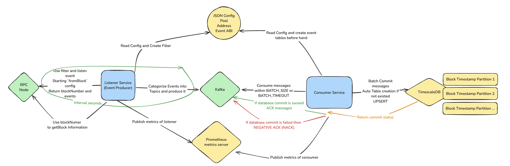
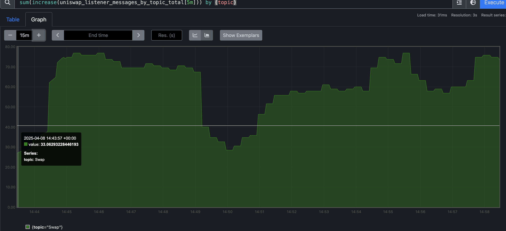
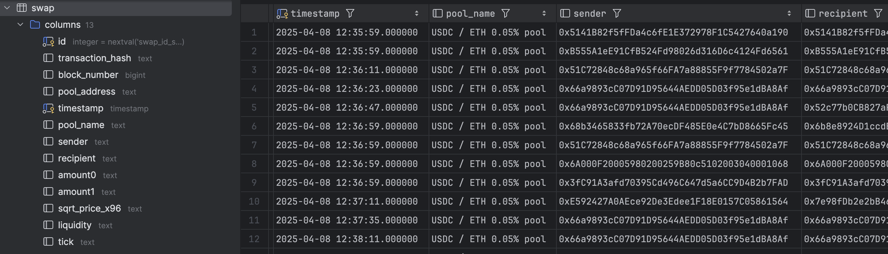

# uniswap-v3-event-pipeline


## Overview
This project provides a complete data pipeline for monitoring Uniswap V3 pool events in real-time. It captures events from the Ethereum blockchain, processes them through Kafka, and stores them in a TimescaleDB database for analysis and visualization.


## Architecture
The pipeline consists of the following components:
- **Listener Service (Python)**: Connects to Ethereum nodes, listens for Uniswap V3 pool events, and publishes them to Kafka topics
- **Consumer Service (Python)**: Consumes events from Kafka, processes them, and stores them in TimescaleDB
- **TimescaleDB**: Time-series database for efficient storage and querying of event data. Key design:
    - Since events are organized by block number and timestamp, it's easy to query by time range.
    - Sequential event processing: Trades occur in a strict time sequence
    - Time-based analysis: Most analytics involve time ranges (hourly/daily volume, price movements)
- **Kafka**: Message broker for reliable event streaming between components
- **Prometheus & Grafana**: Monitoring and visualization of pipeline metrics


## Diagram
See online version [here](https://excalidraw.com/#json=y8mmSVf9XIH5SS1MlDyM_,EPl9tRpi7wY49rf1UwQqYw)


## Features

- **Event Capture**: Listens for Uniswap V3 pool events directly from the Ethereum blockchain
- **Configurable Pool Monitoring**: Easily add or remove pools to monitor via configuration
- **Monitoring**: Prometheus metrics and Grafana dashboards for system monitoring
- **Fault Tolerance**: Automatic recovery from failures and message redelivery

## Design Notes
- Listener: all messages are included with metadata in headers (`block_number`, `block_timestamp`, `pool_address`). This helps 
    - Avoid unnecessary deserialization of event data. These metadatas are useful for debugging and more performant in processing messages by order.
- Consumer: manual ACK of kafka messages, in order to ensure that all events are processed and stored in the database. After persisting the event in the database, the consumer will send ACK for all messages in that batch.
    - update env `BATCH_SIZE` or `BATCH_TIMEOUT` to control the batch size and timeout for current batch.
    - This design avoid hitting DB for every single event. Moreover, this can help to dealing with Blockchain Reorg by delaying after a checkpoint interval (aka `BATCH_TIMEOUT`) to ensure that block is confirmed.
- Everything design with all or nothing in mind. So if application is failed, pipeline can always replay from the last checkpoint and ensure data consistency.


## Project Structure

```
uniswap-v3-event-pipeline/
├── abi/
│   └── uniswap_v3_pool.json     # ABI definitions for Uniswap V3 pools
├── config/
│   └── pool_config.json         # Configuration for pools to monitor
├── consumer/
│   ├── Dockerfile               # Dockerfile for the consumer service
│   ├── database_client.py       # Database interaction layer - create and persist data
│   ├── main.py                  # Entry point for consumer service
│   ├── message_consumer.py      # Kafka consumer implementation - consume by BATCH
│   ├── message_processor.py     # Event processing logic - Parse message and categorize data
│   └── requirements.txt         # Python dependencies
├── listener/
│   ├── Dockerfile               # Dockerfile for the listener service
│   ├── event_handler.py         # Event handling - Parse data and send to Kafka
│   ├── event_listener.py        # Event listening - Listen events by config
│   ├── metrics.py               # Metrics Definition
│   ├── message_producer.py      # Message producer for Kafka
│   ├── web3_client.py           # Web3 client for Ethereum node
│   └── requirements.txt         # Python dependencies
├── docker-compose.yml           # Docker Compose file for the pipeline
└── README.md

```


## Getting Started

### Prerequisites

- Docker and Docker Compose
- Ethereum RPC endpoint (Infura, Alchemy, or your own node)

### Setup

1. Clone the repository:
   ```
   git clone https://github.com/yourusername/uniswap-v3-event-pipeline.git
   cd uniswap-v3-event-pipeline
   ```

2. Clone the sample.env file and add your ETH_RPC_URL and any other configuration if needed
   ```
   cp sample.env .env
   ```

3. Start the services:
   ```
   docker-compose up
   ```

### Configuration

To monitor different Uniswap V3 pools, edit the `config/pool_config.json` file:

```json
{
  "pools": [
    {
      "address": "0x88e6A0c2dDD26FEEb64F039a2c41296FcB3f5640",
      "name": "USDC / ETH 0.05% pool",
      "abi_file": "uniswap_v3_pool.json"
    }
  ]
}
```
To monitor other events, you need to add ABI json in `abi/uniswap_v3_pool.json`.

## Monitoring And Query

- Prometheus UI: http://localhost:9090
- Grafana Dashboard: http://localhost:3000

### Sample Dashboard
#### Total Event polled by topic


See more dashboards in `assets`.

## Query TimescaleDB
Connect your database client on http://localhost:5432 with credentials in `.env` file.
Default capturing event is Swap with this schema. (Schema are generated dynamically based on the ABI of the event)

### Sample data


### Data Dump
Attached SQL dump file for TimescaleDB at `dump/swap.sql`.

## Further improvements
- Tuning interval speed of listener: currently running in synchronous mode, and any other calls will blocked. Turn in into async model.
- The listener polling speed is limited by the Ethereum node, consider using WSS.
- Add more metrics for monitoring and alerting.